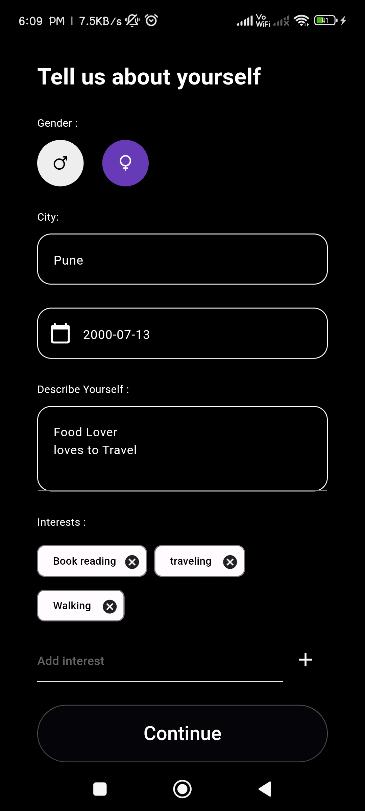
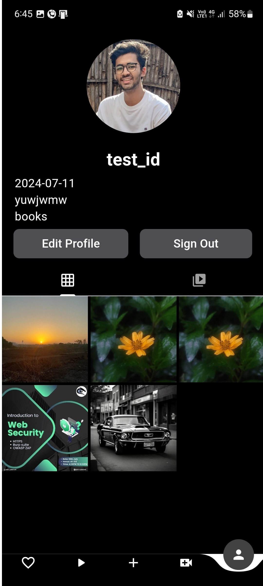
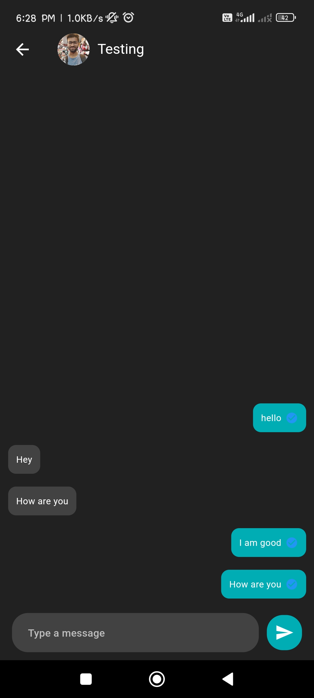
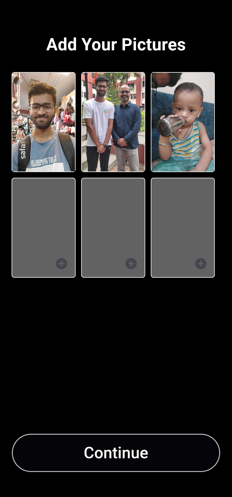

# Flutter Social App

This project is a Flutter mobile application that integrates functionalities inspired by Tinder (swipe-based matching), Omegle (anonymous video chatting), and Instagram (photo sharing and social networking). It utilizes Firebase for the backend services, including authentication, real-time database, cloud storage, and messaging.

The application leverages WebRTC for peer-to-peer video communication and Socket.IO for real-time messaging and room management. It offers a seamless user experience with smooth transitions and responsive UI components built using Flutter widgets.


## Features

- **User Authentication:** Firebase Authentication
- **Real-time Messaging:** Socket.IO
- **Peer-to-Peer Video Communication:** WebRTC
- **Cloud Firestore:** Data storage and retrieval
- **Push Notifications:** Firebase Cloud Messaging
- **Storage:** Firebase Storage for media files
- **Custom Fonts:** Google Fonts

## Technologies Used

- **Firebase:**
  - `firebase_auth: ^4.17.4`
  - `firebase_analytics: ^10.8.6`
  - `firebase_core: ^2.25.4`
  - `cloud_firestore: ^4.15.8`
  - `firebase_storage: ^11.7.1`
  - `firebase_messaging: ^14.8.2`

## Getting Started

### Prerequisites

Ensure you have Flutter installed on your local machine. You can download it from the [official Flutter website](https://flutter.dev/docs/get-started/install).

### Installation

1. **Clone the repository:**

   ```bash
   git clone https://github.com/yourusername/flutter-social-app.git
   cd flutter-social-app
   ```
2. **Install dependencies**:
    ```bash
    flutter pub get
    ```

3. **Configure Firebase**:
    - Create a new project on the Firebase Console.
    - Add an Android and iOS app to your Firebase project.
    - Download the google-services.json file for Android and place it in the android/app directory.
    - Download the GoogleService-Info.plist file for iOS and place it in the ios/Runner directory.


4. **Add Firebase Authentication keys in lib/main.dart**:
    - apiKey: "your_api_key",
    - appId: "your_app_id",
    - storageBucket: "your_storage_bucket",
    - messagingSenderId: "your_messaging_sender_id",
    - projectId: "your_project_id",


5. **Add your server key in lib/services/notification_services.dart**:
    ```bash
    flutter run
    ```
6. **Run the application on emulators or mobile devices**:
    ```bash
    const String serverKey = 'your_server_key';
    ```

### App Insights
### Real Time Chatting with Typing indicators 
       
## Usage
  This app provides a combination of social media features:
    
  - Swipe Matching: Swipe left or right to find matches similar to Tinder.
  - Random Video Chat: Connect randomly with users via WebRTC, similar to Omegle.
  - Photo & Video Sharing: Share photos and videos, similar to Instagram.
